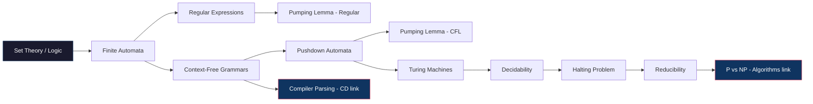

# Theory_Of_Computation

# Theory of Computation — Roadmap

A structured map of Theory of Computation: where it came from, how its branches connect, and what each one covers. Built for GATE CSE 2027 preparation, sequenced by dependency rather than textbook order.

---

## Contents

- [Origins](#origins)
- [Roadmap Diagram](#roadmap-diagram)
- [Branch Dependency Map](#branch-dependency-map)
- [Chomsky Hierarchy](#chomsky-hierarchy)
- [Finite Automata](#finite-automata)
- [Regular Languages & Regular Expressions](#regular-languages--regular-expressions)
- [Context-Free Grammars](#context-free-grammars)
- [Pushdown Automata](#pushdown-automata)
- [Turing Machines](#turing-machines)
- [Decidability & Undecidability](#decidability--undecidability)
- [Pumping Lemmas](#pumping-lemmas)
- [GATE Weightage Summary](#gate-weightage-summary)
- [Recommended Study Sequence](#recommended-study-sequence)

---

## Origins

Theory of Computation is the field that asks a question no one had asked precisely before the 20th century: *what does it mean for something to be computable at all?*

**1900 — Hilbert's program.** David Hilbert posed a set of foundational problems for mathematics, including the *Entscheidungsproblem* (decision problem): is there a mechanical procedure that can determine, for any mathematical statement, whether it is true or false? This question presumed an answer would eventually be "yes" — that mathematics was, in principle, fully mechanizable.

**1931 — Gödel breaks the foundations.** Kurt Gödel's incompleteness theorems proved that any formal system powerful enough to express arithmetic contains true statements that cannot be proven within that system. This didn't answer Hilbert's question, but it revealed that the answer might be "no" — and it forced mathematicians to formally define what a "mechanical procedure" even *was*, since Gödel's proof depended on precisely encoding logical statements as numbers.

**1936 — Three answers arrive independently.** Within months of each other, three different formalizations of "mechanical computation" appeared:
- **Alonzo Church** defined computability using the *lambda calculus*, a formal system for function definition and application.
- **Alan Turing** defined computability using an abstract machine — a read/write head moving over an infinite tape, following a finite set of rules. This is the **Turing machine**, and it remains the standard model of computation used today.
- **Emil Post** independently developed an equivalent formal rewriting system around the same time.

Church and Turing then proved their two models were *equivalent* — anything computable by lambda calculus is computable by a Turing machine, and vice versa. This equivalence is now the **Church-Turing thesis**: the informal notion of "algorithm" is captured exactly by these formal models. Turing used his machine to prove the *halting problem* is undecidable — there is no general algorithm that can determine, for every possible program and input, whether that program will eventually halt. This was the first proof that some well-defined problems are fundamentally unsolvable by any computer, no matter how much time or memory it has.

**1950s-1956 — automata theory and formal languages emerge separately.** Stephen Kleene, working on neural network models with Warren McCulloch and Walter Pitts, formalized *finite automata* and *regular expressions* (1951/1956) as models of the simplest possible computing devices — machines with no memory beyond their current state.

**1956 — Chomsky unifies language and computation.** Linguist Noam Chomsky, while trying to formally characterize human language, defined the **Chomsky hierarchy**: four nested classes of formal grammars (regular, context-free, context-sensitive, unrestricted), each corresponding to a different class of automaton with a different amount of "memory." This was the moment linguistics and automata theory merged into a single mathematical framework — a grammar for generating strings and a machine for recognizing them turned out to be two views of the same object.

**Rest of the 20th century — the field settles into computer science.** As real computers were built, the theoretical hierarchy Turing, Kleene, and Chomsky had defined mapped directly onto practical concerns: finite automata became the model for lexical analysis in compilers and for hardware with bounded memory (like traffic lights or vending machines); context-free grammars became the backbone of programming language syntax and parsing; Turing machines became the yardstick for defining what "efficiently solvable" (P), "verifiable" (NP), and "unsolvable" (undecidable) mean — the foundation later used to define computational complexity theory.

The throughline: TOC exists because in the 1930s mathematicians needed to prove that not everything is computable, and in doing so they accidentally built the exact toolkit computer science would need decades later — automata for compiler design, grammars for parsing, and the halting problem's proof technique (diagonalization) for reasoning about the limits of every algorithm ever written.

---

## Roadmap Diagram

```mermaid
flowchart TD
    A[Theory of Computation] --> B[Formal Language Theory]
    A --> C[Automata Theory]
    A --> D[Computability Theory]

    B --> B1[Chomsky Hierarchy]
    B1 --> B1a[Type 3: Regular]
    B1 --> B1b[Type 2: Context-Free]
    B1 --> B1c[Type 1: Context-Sensitive]
    B1 --> B1d[Type 0: Unrestricted]

    C --> C1[Finite Automata]
    C1 --> C1a[DFA]
    C1 --> C1b[NFA]
    C1 --> C1c[Epsilon-NFA]
    C1 --> C1d[Regular Expressions]
    C1 --> C1e[Pumping Lemma - Regular]

    C --> C2[Pushdown Automata]
    C2 --> C2a[Context-Free Grammars]
    C2 --> C2b[CNF / GNF Normal Forms]
    C2 --> C2c[Pumping Lemma - CFL]
    C2 --> C2d[Ambiguity in Grammars]

    C --> C3[Linear Bounded Automata]
    C3 --> C3a[Context-Sensitive Grammars]

    D --> D1[Turing Machines]
    D1 --> D1a[Standard TM]
    D1 --> D1b[Multi-tape / Non-deterministic TM]
    D1 --> D1c[Universal Turing Machine]

    D --> D2[Decidability]
    D2 --> D2a[Decidable Problems]
    D2 --> D2b[Halting Problem]
    D2 --> D2c[Recursively Enumerable Languages]
    D2 --> D2d[Rice's Theorem]

    D --> D3[Complexity Link]
    D3 --> D3a[P and NP - feeds Algorithms]

    style A fill:#1a1a2e,stroke:#0f3460,color:#fff
    style B fill:#16213e,stroke:#0f3460,color:#fff
    style C fill:#16213e,stroke:#0f3460,color:#fff
    style D fill:#16213e,stroke:#0f3460,color:#fff
```

*Note: Mermaid diagrams render natively in GitHub READMEs. No external image hosting needed.*

---

## Branch Dependency Map

Which concepts you need before others make sense — TOC is unusually linear compared to other GATE subjects.

The two right-hand endpoints — **Compiler parsing** and **P vs NP** — are why TOC matters beyond the exam: context-free grammars are the literal foundation of Compiler Design, and decidability/reducibility is the conceptual foundation of computational complexity in Algorithms.

---

## Chomsky Hierarchy

The organizing skeleton of the entire subject — everything else in TOC is an elaboration of one of these four levels.

| Type | Grammar | Automaton | Closure under |
|---|---|---|---|
| Type 3 | Regular | Finite Automaton (DFA/NFA) | union, concat, star, complement, intersection |
| Type 2 | Context-Free | Pushdown Automaton | union, concat, star (not intersection/complement in general) |
| Type 1 | Context-Sensitive | Linear Bounded Automaton | union, concat, intersection |
| Type 0 | Unrestricted | Turing Machine | union, concat, star |

Each level strictly contains the one below it — every regular language is context-free, every context-free language is context-sensitive, and so on. GATE tests this containment relationship directly, often via closure-property questions.

---

## Finite Automata

The simplest computing model — no memory beyond the current state.

- **DFA (Deterministic Finite Automaton)** — exactly one transition per input symbol per state; no ambiguity
- **NFA (Non-deterministic Finite Automaton)** — multiple possible transitions; equivalent in power to DFA (every NFA has an equivalent DFA via subset construction)
- **Epsilon-NFA** — transitions without consuming input; still equivalent in power to DFA
- **Minimization of DFA** — collapsing equivalent states to the smallest possible automaton
- **Moore and Mealy machines** — automata that produce output, not just accept/reject

Exam trap: NFA-to-DFA subset construction and DFA minimization are two of the most computation-heavy question types in GATE TOC — practice the mechanical procedure until it's automatic, not just conceptually understood.

## Regular Languages & Regular Expressions

- **Regular expressions** — the algebraic notation for describing regular languages (union, concatenation, Kleene star)
- **Equivalence** — regular expressions, DFAs, and NFAs all describe exactly the same class of languages (proved via constructive conversions both directions)
- **Closure properties** — regular languages are closed under union, intersection, complement, concatenation, and Kleene star
- **Myhill-Nerode theorem** — a language-theoretic test for whether a language is regular, based on distinguishing input strings

## Context-Free Grammars

- **Grammar components** — terminals, non-terminals, production rules, start symbol
- **Derivations** — leftmost derivation, rightmost derivation, derivation (parse) trees
- **Ambiguity** — a grammar is ambiguous if some string has more than one parse tree; ambiguous grammars are a recurring GATE question type
- **Normal forms** — Chomsky Normal Form (CNF), Greibach Normal Form (GNF) — standardized forms used for parsing algorithms and proofs
- **Simplification** — removing null productions, unit productions, and useless symbols

Direct link forward: CFGs are the mathematical object underlying every programming language's syntax definition — this is the direct prerequisite for Compiler Design's parsing unit.

## Pushdown Automata

The automaton that corresponds to context-free grammars — a finite automaton plus a stack.

- **PDA structure** — states, input alphabet, stack alphabet, transitions that can push/pop
- **Deterministic vs. non-deterministic PDA** — unlike finite automata, these are *not* equivalent in power; DPDAs recognize a strict subset of context-free languages
- **Equivalence with CFGs** — every CFG has an equivalent PDA and vice versa (constructive proof, occasionally tested)
- **Acceptance by final state vs. acceptance by empty stack** — two equivalent but distinct formalizations

## Turing Machines

The most powerful model in the hierarchy — the formal definition of "algorithm" itself.

- **Standard TM** — infinite tape, read/write head, finite state control, transition function
- **Variants** — multi-tape TM, non-deterministic TM, TM with multiple tracks — all provably equivalent in power to the standard single-tape TM (though not necessarily in speed)
- **Universal Turing Machine** — a single TM that can simulate any other TM given its description as input; the theoretical basis for the idea of a general-purpose, programmable computer
- **Church-Turing thesis** — the claim (not a theorem) that Turing machines capture exactly the informal notion of "algorithm"

## Decidability & Undecidability

Where TOC answers its founding question: what can't be computed, ever, by any machine.

- **Decidable languages** — a TM exists that halts on every input and correctly accepts/rejects
- **Recursively enumerable (RE) languages** — a TM exists that halts and accepts on every string in the language, but may loop forever on strings not in the language
- **The Halting Problem** — proved undecidable by Turing using a diagonalization argument; the single most important negative result in the subject
- **Reducibility** — proving a new problem undecidable by reducing the Halting Problem to it, rather than re-deriving undecidability from scratch each time
- **Rice's Theorem** — any non-trivial property of the language recognized by a Turing machine is undecidable; a powerful shortcut for immediately classifying a huge range of problems as undecidable

Exam trap: GATE frequently gives a problem statement and asks "decidable, undecidable, or semi-decidable (RE)?" — the fast method is checking whether it reduces to a known undecidable problem (usually the Halting Problem), not proving it from first principles under time pressure.

## Pumping Lemmas

The standard tool for proving a language does *not* belong to a class — used constantly to prove non-regularity or non-context-freeness.

- **Pumping Lemma for Regular Languages** — every sufficiently long string in a regular language can be "pumped" (a middle section repeated) and the result stays in the language; used via proof by contradiction to show a language is *not* regular
- **Pumping Lemma for Context-Free Languages** — the analogous, more complex statement for CFLs, used to show a language is *not* context-free

Exam trap: the pumping lemma proves a language is *not* in a class — it can never be used to prove a language *is* regular or context-free. GATE occasionally sets a trap answer built on this exact misuse.

---

## GATE Weightage Summary

| Topic | Typical GATE Weight | Feeds Into |
|---|---|---|
| Finite Automata (DFA/NFA, minimization) | High | Compiler Design (lexical analysis) |
| Regular Expressions & Regular Languages | High | Compiler Design |
| Context-Free Grammars & Ambiguity | High | Compiler Design (parsing) |
| Pushdown Automata | Medium | Conceptual bridge to CFGs |
| Turing Machines | Medium | Complexity Theory |
| Decidability / Undecidability / Rice's Theorem | Medium-High | Algorithms (P vs NP framing) |
| Pumping Lemma (Regular & CFL) | Medium | Standalone proof-technique questions |
| Chomsky Hierarchy / Closure Properties | Medium | Ties the whole subject together |

TOC is consistently one of the higher-yield-per-hour subjects in GATE CSE because the topic pool is well-bounded and question types repeat predictably year to year, compared to broader subjects like DBMS or OS.

---

## Recommended Study Sequence

1. Finite Automata (DFA, NFA, epsilon-NFA, minimization) — the entire subject's mechanical foundation
2. Regular Expressions & closure properties (direct extension of FA)
3. Pumping Lemma for Regular Languages (needs FA + RE understood first)
4. Context-Free Grammars, ambiguity, normal forms (CNF/GNF)
5. Pushdown Automata (the machine counterpart to CFGs — study together)
6. Pumping Lemma for CFLs (needs PDA/CFG understood first)
7. Turing Machines and variants
8. Decidability, Halting Problem, Rice's Theorem, reducibility (the capstone — needs everything above)

This sequence matches the subject-pairing strategy already in use for the six-phase GATE plan: TOC pairs naturally with Compiler Design (CFGs and parsing overlap directly), and its final decidability unit is the conceptual on-ramp into the P-vs-NP framing used later in Algorithms.
